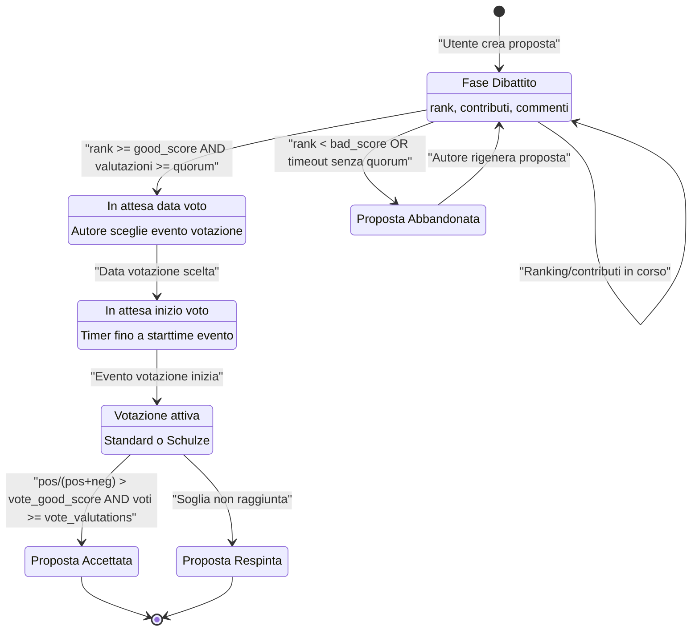

# Ciclo di vita Proposta

```mermaid
stateDiagram-v2
    [*] --> VALUTATION: "Utente crea proposta"
    
    VALUTATION: Fase Dibattito
    VALUTATION: rank, contributi, commenti
    
    VALUTATION --> WAIT_DATE: "rank >= good_score AND valutazioni >= quorum"
    VALUTATION --> ABANDONED: "rank < bad_score OR timeout senza quorum"
    VALUTATION --> VALUTATION: "Ranking/contributi in corso"
    
    WAIT_DATE: In attesa data voto
    WAIT_DATE: Autore sceglie evento votazione
    
    WAIT_DATE --> WAIT: "Data votazione scelta"
    
    WAIT: In attesa inizio voto
    WAIT: Timer fino a starttime evento
    
    WAIT --> VOTING: "Evento votazione inizia"
    
    VOTING: Votazione attiva
    VOTING: Standard o Schulze
    
    VOTING --> ACCEPTED: "pos/(pos+neg) > vote_good_score AND voti >= vote_valutations"
    VOTING --> REJECTED: "Soglia non raggiunta"
    
    ACCEPTED: Proposta Accettata
    REJECTED: Proposta Respinta
    ABANDONED: Proposta Abbandonata
    
    ABANDONED --> VALUTATION: "Autore rigenera proposta"
    
    ACCEPTED --> [*]
    REJECTED --> [*]
```
