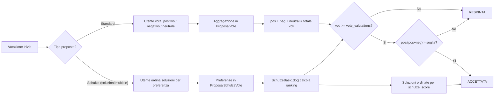

# Flusso Votazione (Standard vs Schulze)

```mermaid
flowchart LR
    A["Votazione inizia"] --> B{"Tipo proposta?"}
    
    B -->|"Standard"| C["Utente vota: positivo / negativo / neutrale"]
    B -->|"Schulze (soluzioni multiple)"| D["Utente ordina soluzioni per preferenza"]
    
    C --> E["Aggregazione in ProposalVote"]
    E --> F["pos + neg + neutral = totale voti"]
    
    D --> G["Preferenze in ProposalSchulzeVote"]
    G --> H["SchulzeBasic.do() calcola ranking"]
    
    F --> I{"voti >= vote_valutations?"}
    H --> I
    
    I -->|"No"| J["RESPINTA"]
    I -->|"Si"| K{"pos/(pos+neg) > soglia?"}
    
    K -->|"Si"| L["ACCETTATA"]
    K -->|"No"| J
    
    H --> M["Soluzioni ordinate per schulze_score"]
    M --> L
```
