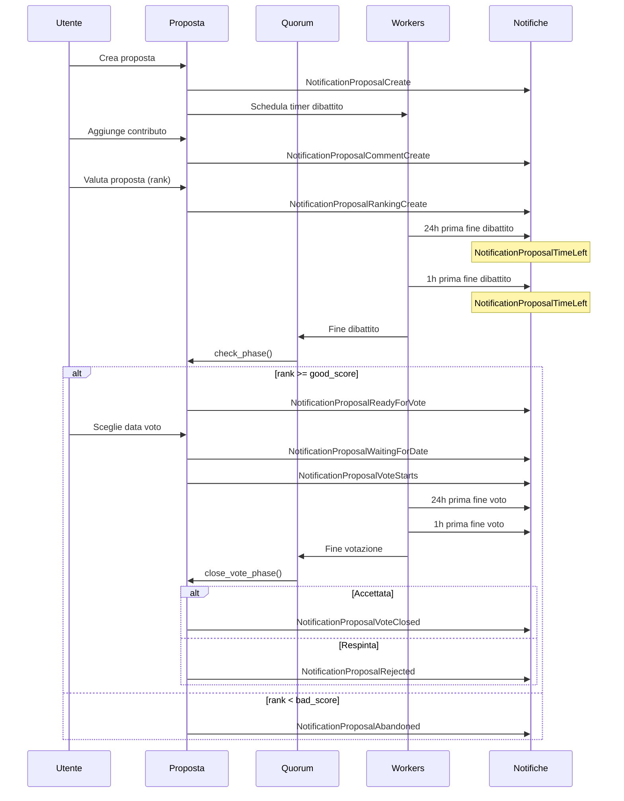

# Sistema Notifiche Proposte

```mermaid
sequenceDiagram
    participant U as Utente
    participant P as Proposta
    participant Q as Quorum
    participant W as Workers
    participant N as Notifiche

    U->>P: Crea proposta
    P->>N: NotificationProposalCreate
    P->>W: Schedula timer dibattito

    U->>P: Aggiunge contributo
    P->>N: NotificationProposalCommentCreate

    U->>P: Valuta proposta (rank)
    P->>N: NotificationProposalRankingCreate

    W->>N: 24h prima fine dibattito
    Note over N: NotificationProposalTimeLeft

    W->>N: 1h prima fine dibattito
    Note over N: NotificationProposalTimeLeft

    W->>Q: Fine dibattito
    Q->>P: check_phase()

    alt rank >= good_score
        P->>N: NotificationProposalReadyForVote
        U->>P: Sceglie data voto
        P->>N: NotificationProposalWaitingForDate
        P->>N: NotificationProposalVoteStarts
        W->>N: 24h prima fine voto
        W->>N: 1h prima fine voto
        W->>Q: Fine votazione
        Q->>P: close_vote_phase()
        alt Accettata
            P->>N: NotificationProposalVoteClosed
        else Respinta
            P->>N: NotificationProposalRejected
        end
    else rank < bad_score
        P->>N: NotificationProposalAbandoned
    end
```
