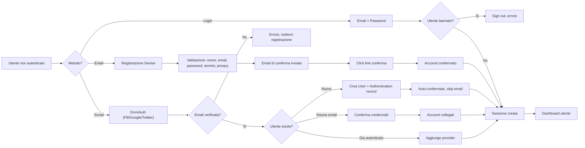

# Flusso Autenticazione

```mermaid
flowchart LR
    A["Utente non autenticato"] --> B{"Metodo?"}
    
    B -->|"Email"| C["Registrazione Devise"]
    B -->|"Social"| D["OmniAuth (FB/Google/Twitter)"]
    B -->|"Login"| E["Email + Password"]
    
    C --> F["Validazione: nome, email, password, termini, privacy"]
    F --> G["Email di conferma inviata"]
    G --> H["Click link conferma"]
    H --> I["Account confermato"]
    
    D --> J{"Email verificata?"}
    J -->|"No"| K["Errore, redirect registrazione"]
    J -->|"Si"| L{"Utente esiste?"}
    
    L -->|"Nuovo"| M["Crea User + Authentication record"]
    M --> N["Auto-confermato, skip email"]
    
    L -->|"Stessa email"| O["Conferma credenziali"]
    O --> P["Account collegati"]
    
    L -->|"Gia autenticato"| Q["Aggiunge provider"]
    
    E --> R{"Utente bannato?"}
    R -->|"Si"| S["Sign out, errore"]
    R -->|"No"| T["Sessione creata"]
    
    I --> T
    N --> T
    P --> T
    Q --> T
    
    T --> U["Dashboard utente"]
```
