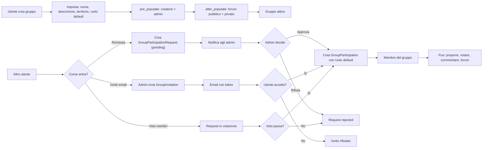

# Flusso Gruppi e Partecipazione

```mermaid
flowchart LR
    A["Utente crea gruppo"] --> B["Imposta: nome, descrizione, territorio, ruolo default"]
    B --> C["pre_populate: creatore = admin"]
    C --> D["after_populate: forum pubblico + privato"]
    D --> E["Gruppo attivo"]
    
    F["Altro utente"] --> G{"Come entra?"}
    
    G -->|"Richiesta"| H["Crea GroupParticipationRequest (pending)"]
    H --> I["Notifica agli admin"]
    I --> J{"Admin decide"}
    J -->|"Approva"| K["Crea GroupParticipation con ruolo default"]
    J -->|"Rifiuta"| L["Request rejected"]
    
    G -->|"Invito email"| M["Admin invia GroupInvitation"]
    M --> N["Email con token"]
    N --> O{"Utente accetta?"}
    O -->|"Si"| K
    O -->|"No"| P["Invito rifiutato"]
    
    G -->|"Voto membri"| Q["Request in votazione"]
    Q --> R{"Voto passa?"}
    R -->|"Si"| K
    R -->|"No"| L
    
    K --> S["Membro del gruppo"]
    S --> T["Puo: proporre, votare, commentare, forum"]
```
