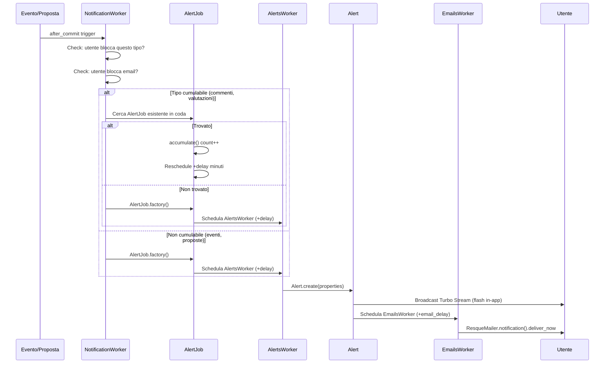

# Sistema Notifiche (architettura)

```mermaid
sequenceDiagram
    participant E as Evento/Proposta
    participant W as NotificationWorker
    participant AJ as AlertJob
    participant AW as AlertsWorker
    participant A as Alert
    participant EW as EmailsWorker
    participant U as Utente

    E->>W: after_commit trigger
    W->>W: Check: utente blocca questo tipo?
    W->>W: Check: utente blocca email?
    
    alt Tipo cumulabile (commenti, valutazioni)
        W->>AJ: Cerca AlertJob esistente in coda
        alt Trovato
            AJ->>AJ: accumulate() count++
            AJ->>AJ: Reschedule +delay minuti
        else Non trovato
            W->>AJ: AlertJob.factory()
            AJ->>AW: Schedula AlertsWorker (+delay)
        end
    else Non cumulabile (eventi, proposte)
        W->>AJ: AlertJob.factory()
        AJ->>AW: Schedula AlertsWorker (+delay)
    end

    AW->>A: Alert.create(properties)
    A->>U: Broadcast Turbo Stream (flash in-app)
    A->>EW: Schedula EmailsWorker (+email_delay)
    EW->>U: ResqueMailer.notification().deliver_now
```
