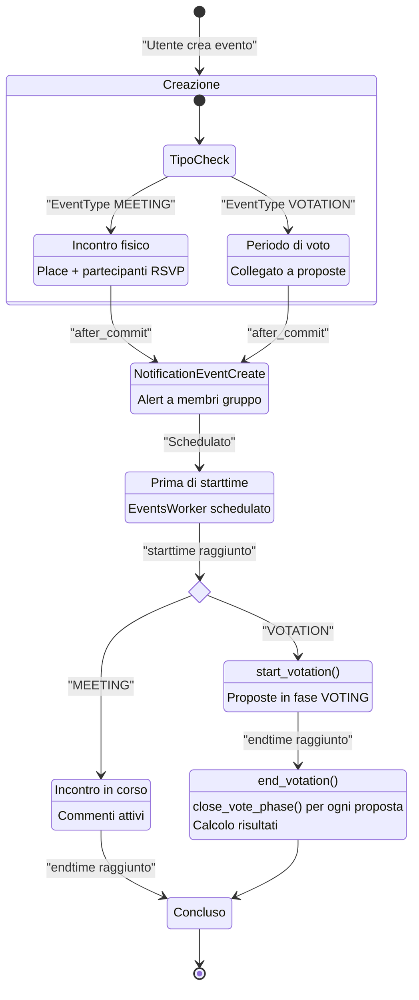

# Sistema Eventi e Votazioni

```mermaid
stateDiagram-v2
    [*] --> Creazione: "Utente crea evento"
    
    state Creazione {
        [*] --> TipoCheck
        TipoCheck --> Meeting: "EventType MEETING"
        TipoCheck --> Votazione: "EventType VOTATION"
    }
    
    Meeting: Incontro fisico
    Meeting: Place + partecipanti RSVP
    
    Votazione: Periodo di voto
    Votazione: Collegato a proposte
    
    Meeting --> Notifica: "after_commit"
    Votazione --> Notifica: "after_commit"
    
    Notifica: NotificationEventCreate
    Notifica: Alert a membri gruppo
    
    Notifica --> InAttesa: "Schedulato"
    
    InAttesa: Prima di starttime
    InAttesa: EventsWorker schedulato
    
    state if_type <<choice>>
    InAttesa --> if_type: "starttime raggiunto"
    
    if_type --> MeetingAttivo: "MEETING"
    if_type --> VotazioneAttiva: "VOTATION"
    
    MeetingAttivo: Incontro in corso
    MeetingAttivo: Commenti attivi
    
    VotazioneAttiva: start_votation()
    VotazioneAttiva: Proposte in fase VOTING
    
    MeetingAttivo --> Concluso: "endtime raggiunto"
    VotazioneAttiva --> ChiusuraVoto: "endtime raggiunto"
    
    ChiusuraVoto: end_votation()
    ChiusuraVoto: close_vote_phase() per ogni proposta
    ChiusuraVoto: Calcolo risultati
    
    ChiusuraVoto --> Concluso
    Concluso --> [*]
```
