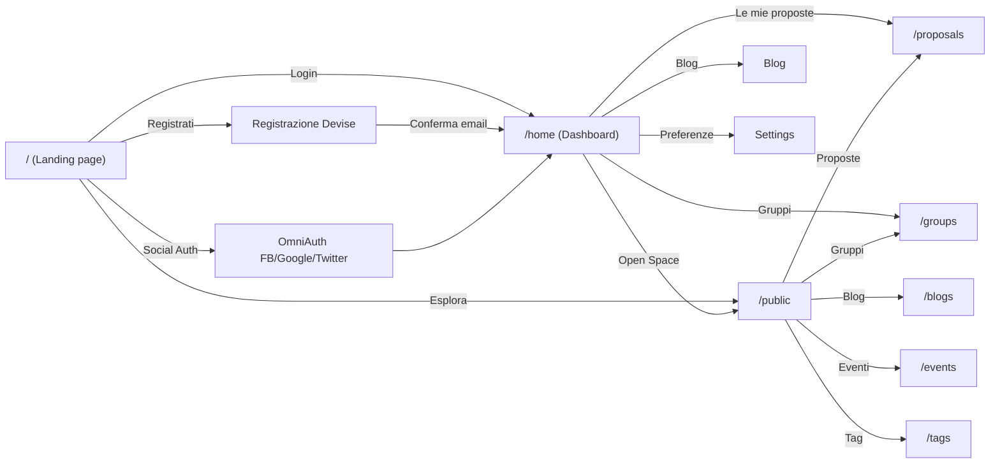
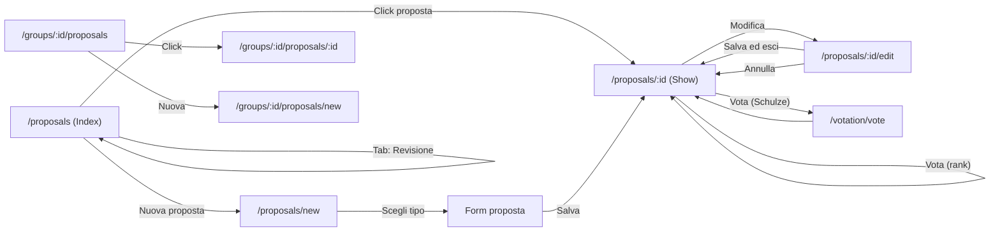
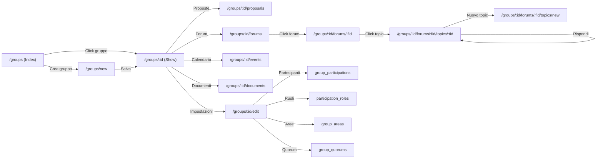
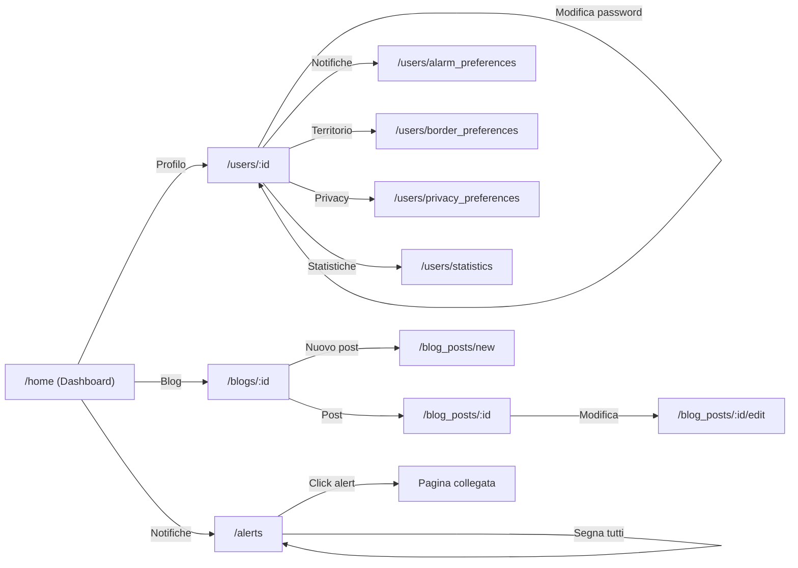

# Navigazione Pagine — Mappa Completa

## Flusso principale utente

```mermaid
flowchart LR
    Landing["/ (Landing page)"] -->|"Login"| Dashboard
    Landing -->|"Registrati"| Register["Registrazione Devise"]
    Landing -->|"Esplora"| OpenSpace
    Landing -->|"Social Auth"| OAuth["OmniAuth FB/Google/Twitter"]
    
    Register -->|"Conferma email"| Dashboard["/home (Dashboard)"]
    OAuth --> Dashboard
    
    Dashboard -->|"Le mie proposte"| Proposals
    Dashboard -->|"Gruppi"| Groups
    Dashboard -->|"Blog"| Blog
    Dashboard -->|"Preferenze"| Settings
    Dashboard -->|"Open Space"| OpenSpace["/public"]
    
    OpenSpace -->|"Proposte"| Proposals["/proposals"]
    OpenSpace -->|"Gruppi"| Groups["/groups"]
    OpenSpace -->|"Blog"| Blogs["/blogs"]
    OpenSpace -->|"Eventi"| Events["/events"]
    OpenSpace -->|"Tag"| Tags["/tags"]
```

## Flusso Proposte

```mermaid
flowchart LR
    PI["/proposals (Index)"] -->|"Click proposta"| PS["/proposals/:id (Show)"]
    PI -->|"Nuova proposta"| PN["/proposals/new"]
    PI -->|"Tab: Dibattito"| PI
    PI -->|"Tab: Votazione"| PI
    PI -->|"Tab: Votate"| PI
    PI -->|"Tab: Revisione"| PI
    
    PN -->|"Scegli tipo"| PF["Form proposta"]
    PF -->|"Salva"| PS
    
    PS -->|"Modifica"| PE["/proposals/:id/edit"]
    PS -->|"Commenta"| PS
    PS -->|"Vota (rank)"| PS
    PS -->|"Vota (Schulze)"| Votation["/votation/vote"]
    
    PE -->|"Salva ed esci"| PS
    PE -->|"Annulla"| PS
    
    Votation --> PS
    
    GPI["/groups/:id/proposals"] -->|"Click"| GPS["/groups/:id/proposals/:id"]
    GPI -->|"Nuova"| GPN["/groups/:id/proposals/new"]
```

## Flusso Gruppi

```mermaid
flowchart LR
    GI["/groups (Index)"] -->|"Click gruppo"| GS["/groups/:id (Show)"]
    GI -->|"Crea gruppo"| GN["/groups/new"]
    
    GN -->|"Salva"| GS
    
    GS -->|"Proposte"| GP["/groups/:id/proposals"]
    GS -->|"Forum"| GF["/groups/:id/forums"]
    GS -->|"Calendario"| GE["/groups/:id/events"]
    GS -->|"Documenti"| GD["/groups/:id/documents"]
    GS -->|"Impostazioni"| GSE["/groups/:id/edit"]
    
    GF -->|"Click forum"| GFS["/groups/:id/forums/:fid"]
    GFS -->|"Click topic"| GFT["/groups/:id/forums/:fid/topics/:tid"]
    GFT -->|"Rispondi"| GFT
    GFT -->|"Nuovo topic"| GFTN["/groups/:id/forums/:fid/topics/new"]
    
    GSE -->|"Partecipanti"| GSEP["group_participations"]
    GSE -->|"Ruoli"| GSER["participation_roles"]
    GSE -->|"Aree"| GSEA["group_areas"]
    GSE -->|"Quorum"| GSEQ["group_quorums"]
```

## Flusso Utente

```mermaid
flowchart LR
    D["/home (Dashboard)"] -->|"Profilo"| UP["/users/:id"]
    D -->|"Blog"| UB["/blogs/:id"]
    D -->|"Notifiche"| UA["/alerts"]
    
    UP -->|"Modifica nome"| UP
    UP -->|"Modifica email"| UP
    UP -->|"Modifica password"| UP
    
    UP -->|"Notifiche"| UAN["/users/alarm_preferences"]
    UP -->|"Territorio"| UBP["/users/border_preferences"]
    UP -->|"Privacy"| UPP["/users/privacy_preferences"]
    UP -->|"Statistiche"| UST["/users/statistics"]
    
    UA -->|"Click alert"| Target["Pagina collegata"]
    UA -->|"Segna letto"| UA
    UA -->|"Segna tutti"| UA
    
    UB -->|"Nuovo post"| UBN["/blog_posts/new"]
    UB -->|"Post"| UBS["/blog_posts/:id"]
    UBS -->|"Modifica"| UBE["/blog_posts/:id/edit"]
```
