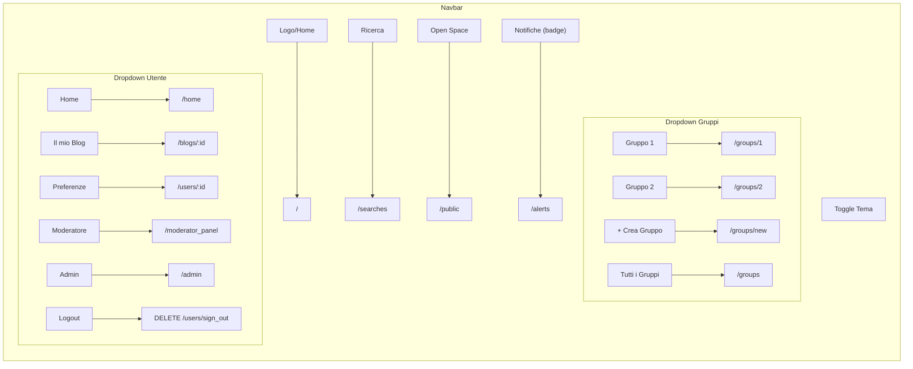
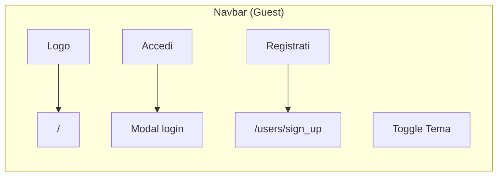

# Top Menu — Struttura Navigazione

```mermaid
flowchart LR
    subgraph TopMenu["Navbar"]
        Logo["Logo/Home"] --> Root["/"]
        
        Search["Ricerca"] --> SearchPage["/searches"]
        
        Globe["Open Space"] --> OS["/public"]
        
        subgraph GroupsDD["Dropdown Gruppi"]
            G1["Gruppo 1"] --> GP1["/groups/1"]
            G2["Gruppo 2"] --> GP2["/groups/2"]
            GNew["+ Crea Gruppo"] --> GN["/groups/new"]
            GAll["Tutti i Gruppi"] --> GA["/groups"]
        end
        
        Bell["Notifiche (badge)"] --> Alerts["/alerts"]
        
        subgraph UserDD["Dropdown Utente"]
            UHome["Home"] --> UH["/home"]
            UBlog["Il mio Blog"] --> UBL["/blogs/:id"]
            UPref["Preferenze"] --> UP["/users/:id"]
            UMod["Moderatore"] --> MP["/moderator_panel"]
            UAdmin["Admin"] --> AP["/admin"]
            ULogout["Logout"] --> LO["DELETE /users/sign_out"]
        end
        
        Theme["Toggle Tema"]
    end
```

## Menu per utente NON autenticato

```mermaid
flowchart LR
    subgraph TopMenuGuest["Navbar (Guest)"]
        Logo["Logo"] --> Root["/"]
        Login["Accedi"] --> LoginModal["Modal login"]
        Register["Registrati"] --> RegPage["/users/sign_up"]
        Theme["Toggle Tema"]
    end
```
