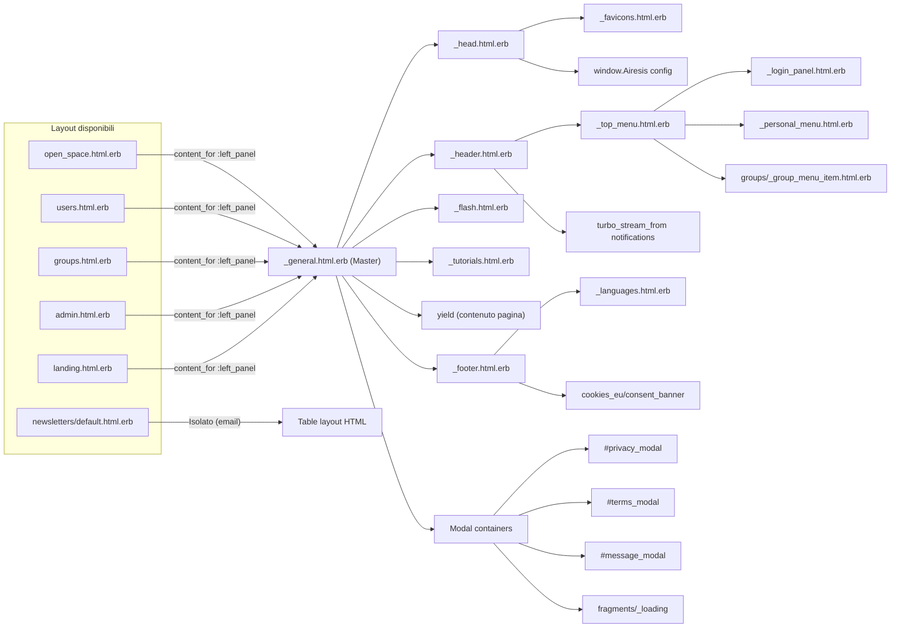
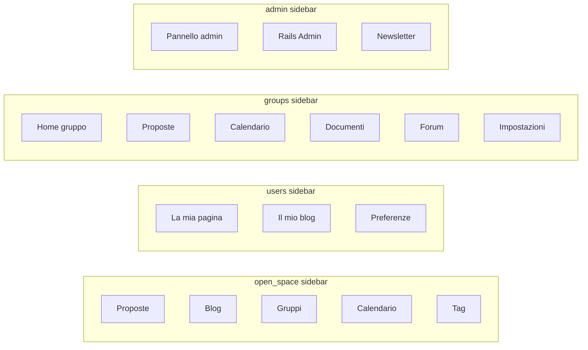
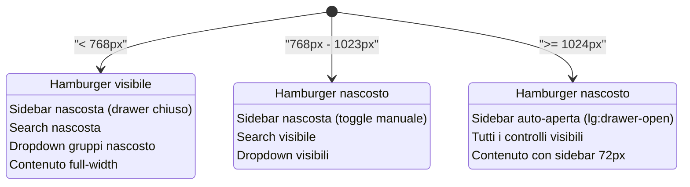
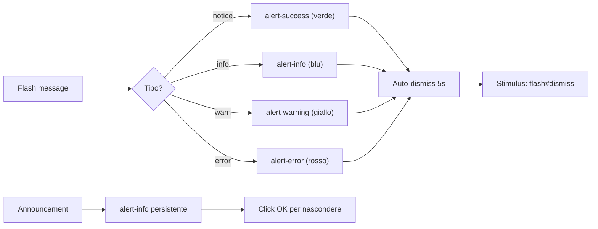

# Albero di Rendering Layout e Partials

## Gerarchia Layout

```mermaid
flowchart LR
    subgraph Layouts["Layout disponibili"]
        OS["open_space.html.erb"]
        US["users.html.erb"]
        GR["groups.html.erb"]
        AD["admin.html.erb"]
        LA["landing.html.erb"]
        NL["newsletters/default.html.erb"]
    end

    OS -->|"content_for :left_panel"| GEN["_general.html.erb (Master)"]
    US -->|"content_for :left_panel"| GEN
    GR -->|"content_for :left_panel"| GEN
    AD -->|"content_for :left_panel"| GEN
    LA -->|"content_for :left_panel"| GEN

    NL -->|"Isolato (email)"| EMAIL["Table layout HTML"]

    GEN --> HEAD["_head.html.erb"]
    GEN --> HEADER["_header.html.erb"]
    GEN --> FLASH["_flash.html.erb"]
    GEN --> TUT["_tutorials.html.erb"]
    GEN --> YIELD["yield (contenuto pagina)"]
    GEN --> FOOTER["_footer.html.erb"]
    GEN --> MODALS["Modal containers"]

    HEAD --> FAV["_favicons.html.erb"]
    HEAD --> JS["window.Airesis config"]

    HEADER --> TOPMENU["_top_menu.html.erb"]
    HEADER --> TURBO["turbo_stream_from notifications"]

    TOPMENU --> LOGIN["_login_panel.html.erb"]
    TOPMENU --> PERSMENU["_personal_menu.html.erb"]
    TOPMENU --> GROUPMENU["groups/_group_menu_item.html.erb"]

    FOOTER --> LANG["_languages.html.erb"]
    FOOTER --> COOKIE["cookies_eu/consent_banner"]

    MODALS --> M1["#privacy_modal"]
    MODALS --> M2["#terms_modal"]
    MODALS --> M3["#message_modal"]
    MODALS --> M4["fragments/_loading"]
```

## Sidebar per Layout

```mermaid
flowchart LR
    subgraph OpenSpace["open_space sidebar"]
        OS1["Proposte"]
        OS2["Blog"]
        OS3["Gruppi"]
        OS4["Calendario"]
        OS5["Tag"]
    end

    subgraph Users["users sidebar"]
        US1["La mia pagina"]
        US2["Il mio blog"]
        US3["Preferenze"]
    end

    subgraph Groups["groups sidebar"]
        GR1["Home gruppo"]
        GR2["Proposte"]
        GR3["Calendario"]
        GR4["Documenti"]
        GR5["Forum"]
        GR6["Impostazioni"]
    end

    subgraph Admin["admin sidebar"]
        AD1["Pannello admin"]
        AD2["Rails Admin"]
        AD3["Newsletter"]
    end
```

## Struttura Responsive

```mermaid
stateDiagram-v2
    [*] --> Mobile: "< 768px"
    [*] --> Tablet: "768px - 1023px"
    [*] --> Desktop: ">= 1024px"

    Mobile: Hamburger visibile
    Mobile: Sidebar nascosta (drawer chiuso)
    Mobile: Search nascosta
    Mobile: Dropdown gruppi nascosto
    Mobile: Contenuto full-width

    Tablet: Hamburger nascosto
    Tablet: Sidebar nascosta (toggle manuale)
    Tablet: Search visibile
    Tablet: Dropdown visibili

    Desktop: Hamburger nascosto
    Desktop: Sidebar auto-aperta (lg:drawer-open)
    Desktop: Tutti i controlli visibili
    Desktop: Contenuto con sidebar 72px
```

## Flash Messages

```mermaid
flowchart LR
    F["Flash message"] --> T{"Tipo?"}
    T -->|"notice"| S["alert-success (verde)"]
    T -->|"info"| I["alert-info (blu)"]
    T -->|"warn"| W["alert-warning (giallo)"]
    T -->|"error"| E["alert-error (rosso)"]

    S --> D["Auto-dismiss 5s"]
    I --> D
    W --> D
    E --> D

    A["Announcement"] --> P["alert-info persistente"]
    P --> OK["Click OK per nascondere"]

    D --> SC["Stimulus: flash#dismiss"]
```
